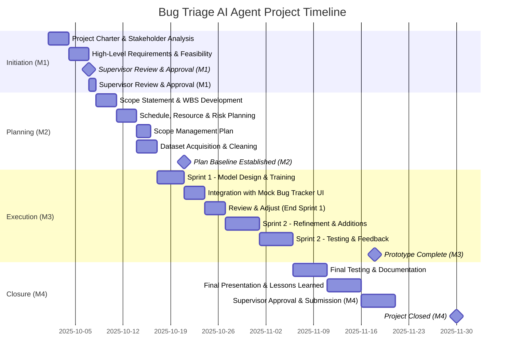
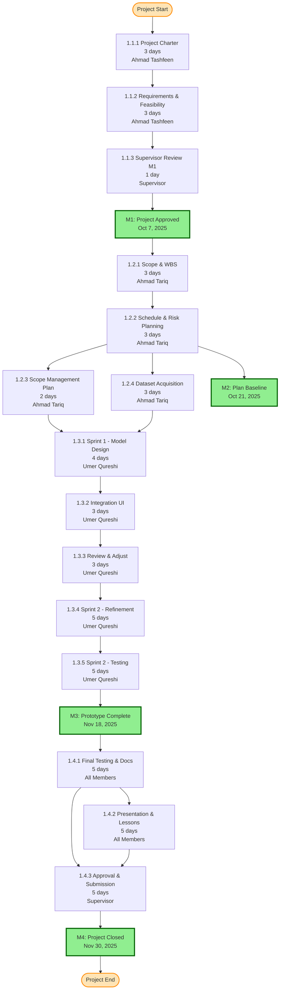
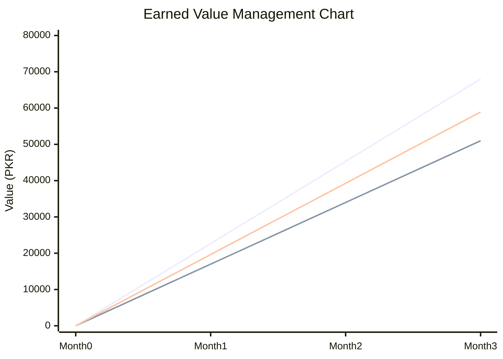

# Report Section 2: Project Management Artifacts

## Purpose
This section documents all project management artifacts including Work Breakdown Structure (WBS), Gantt Chart, Cost Estimation, Risk Register, and Quality Plan.

## Target Length
3-4 pages in the final PDF report (with diagrams in appendices)

## Content Structure

### 2.1 Work Breakdown Structure (WBS)

**Status:** ✅ Already created in `C_i221534_i222490_i222578_SPM_A02/WBS - BUG TRIAGE AI Agent.pdf`

**Content to Include:**

**WBS Hierarchy:**
```
1.0 Bug Triage AI Agent Project
├── 1.1 Initiation (M1)
│   ├── 1.1.1 Project Charter & Stakeholder Analysis
│   ├── 1.1.2 High-Level Requirements & Feasibility
│   └── 1.1.3 Supervisor Review & Approval (M1)
├── 1.2 Planning (M2)
│   ├── 1.2.1 Scope Statement & WBS Development
│   ├── 1.2.2 Schedule, Resource & Risk Planning
│   ├── 1.2.3 Scope Management Plan
│   └── 1.2.4 Dataset Acquisition & Cleaning
├── 1.3 Execution (M3)
│   ├── 1.3.1 Sprint 1 - Model Design & Training
│   ├── 1.3.2 Integration with Mock Bug Tracker UI
│   ├── 1.3.3 Review & Adjust (End Sprint 1)
│   ├── 1.3.4 Sprint 2 - Refinement & Additions
│   └── 1.3.5 Sprint 2 - Testing & Feedback
└── 1.4 Closure (M4)
    ├── 1.4.1 Final Testing & Documentation
    ├── 1.4.2 Final Presentation & Lessons Learned
    └── 1.4.3 Supervisor Approval & Submission (M4)
```

**WBS Details Table:**

| WBS ID | Task Name | Assigned To | Duration (Days) | Start Date | Finish Date |
|--------|-----------|-------------|------------------|------------|-------------|
| 1.1.1 | Project Charter & Stakeholder Analysis | Ahmad Tashfeen | 3 | 2025-10-01 | 2025-10-03 |
| 1.1.2 | High-Level Requirements & Feasibility | Ahmad Tashfeen | 3 | 2025-10-03 | 2025-10-06 |
| 1.1.3 | Supervisor Review & Approval (M1) | Supervisor | 1 | 2025-10-06 | 2025-10-07 |
| 1.2.1 | Scope Statement & WBS Development | Ahmad Tariq | 3 | 2025-10-07 | 2025-10-10 |
| 1.2.2 | Schedule, Resource & Risk Planning | Ahmad Tariq | 3 | 2025-10-10 | 2025-10-13 |
| 1.2.3 | Scope Management Plan | Ahmad Tariq | 2 | 2025-10-13 | 2025-10-15 |
| 1.2.4 | Dataset Acquisition & Cleaning | Ahmad Tariq | 3 | 2025-10-15 | 2025-10-18 |
| 1.3.1 | Sprint 1 - Model Design & Training | Umer Qureshi | 4 | 2025-10-22 | 2025-10-25 |
| 1.3.2 | Integration with Mock Bug Tracker UI | Umer Qureshi | 3 | 2025-10-25 | 2025-10-28 |
| 1.3.3 | Review & Adjust (End Sprint 1) | Umer Qureshi | 3 | 2025-10-28 | 2025-11-01 |
| 1.3.4 | Sprint 2 - Refinement & Additions | Umer Qureshi | 5 | 2025-11-02 | 2025-11-07 |
| 1.3.5 | Sprint 2 - Testing & Feedback | Umer Qureshi | 5 | 2025-11-07 | 2025-11-12 |
| 1.4.1 | Final Testing & Documentation | All Members | 5 | 2025-11-15 | 2025-11-20 |
| 1.4.2 | Final Presentation & Lessons Learned | All Members | 5 | 2025-11-20 | 2025-11-25 |
| 1.4.3 | Supervisor Approval & Submission (M4) | Supervisor | 5 | 2025-11-25 | 2025-11-30 |

**Milestones:**
- **M1: Project Approved** - October 7, 2025
- **M2: Plan Baseline Established** - October 21, 2025
- **M3: Prototype Complete** - November 18, 2025
- **M4: Project Closed** - November 30, 2025

**Reference:** Use existing WBS diagram from `C_i221534_i222490_i222578_SPM_A02/WBS - BUG TRIAGE AI Agent.pdf`

### 2.2 Gantt Chart

**Status:** ✅ Already created in `C_i221534_i222490_i222578_SPM_A02/Project_Gantt_Chart_-_Bug_Triage_AI_Agent_(WBS-Based_A02)[1].jpg`

**Mermaid.js Code for Gantt Chart:**



**Steps to Generate Gantt Chart:**
1. Use Mermaid Live Editor (https://mermaid.live/) or VS Code with Mermaid extension
2. Copy the Mermaid.js code above
3. Paste into the editor
4. The chart will render automatically
5. Export as PNG or SVG for report inclusion
6. Alternatively, reference the existing Gantt chart image

**Reference:** Use existing Gantt chart from `C_i221534_i222490_i222578_SPM_A02/Project_Gantt_Chart_-_Bug_Triage_AI_Agent_(WBS-Based_A02)[1].jpg`

### 2.3 Network Diagram

**Status:** ✅ Already created in `C_i221534_i222490_i222578_SPM_A03/network-diagram.png`

**Mermaid.js Code for Network Diagram (Activity-on-Node):**



**Critical Path Analysis:**
- **Critical Path:** All tasks with Total Slack = 0
- **Path:** 1.1.1 → 1.1.2 → 1.1.3 → 1.2.1 → 1.2.2 → 1.2.4 → 1.3.1 → 1.3.2 → 1.3.3 → 1.3.4 → 1.3.5 → 1.4.1 → 1.4.2 → 1.4.3
- **Total Duration:** 53 days
- **Tasks with Slack:** 1.2.3 (TS: 2), 1.2.4 (TS: 1), 1.4.2 (TS: 2)

**Steps to Generate Network Diagram:**
1. Use Mermaid Live Editor or diagramming tool
2. Copy the Mermaid.js code above
3. Render the diagram
4. Export as PNG/SVG
5. Alternatively, use the existing network diagram from `C_i221534_i222490_i222578_SPM_A03/network-diagram.png`

### 2.4 Cost Estimation and Budget

**Data from Assignment 03:**

**Detailed Cost Breakdown:**

| WBS ID | Task Name | Assigned To | Duration Days | Unit Cost (PKR/day) | Person-Days | Subtotal (PKR) | Notes |
|--------|-----------|-------------|---------------|---------------------|-------------|-----------------|-------|
| 1.1.1 | Project Charter & Stakeholder Analysis | Ahmad Tashfeen | 3 | 2,000 | 3 | 6,000 | Initiation activity |
| 1.1.2 | High-Level Requirements & Feasibility | Ahmad Tashfeen | 3 | 2,000 | 3 | 6,000 | Follows charter completion |
| 1.1.3 | Supervisor Review & Approval (M1) | Supervisor | 1 | 1,500 | 1 | 1,500 | External dependency |
| 1.2.1 | Scope Statement & WBS Development | Ahmad Tariq | 3 | 2,000 | 3 | 6,000 | After M1 approval |
| 1.2.2 | Schedule, Resource & Risk Planning | Ahmad Tariq | 3 | 2,000 | 3 | 6,000 | Needs approved scope |
| 1.2.3 | Scope Management Plan | Ahmad Tariq | 2 | 2,000 | 2 | 4,000 | Can overlap with 1.2.4 |
| 1.2.4 | Dataset Acquisition & Cleaning | Ahmad Tariq | 3 | 2,000 | 3 | 6,000 | Before model training |
| 1.3.1 | Sprint 1 - Model Design & Training | Umer Qureshi | 4 | 2,000 | 4 | 8,000 | Initial ML prototype |
| 1.3.2 | Integration with Mock Bug Tracker UI | Umer Qureshi | 3 | 2,000 | 3 | 6,000 | Post model stability |
| 1.3.3 | Review & Adjust (End Sprint 1) | Umer Qureshi | 3 | 2,000 | 3 | 6,000 | Sprint 1 refinement |
| 1.3.4 | Sprint 2 - Refinement & Additions | Umer Qureshi | 5 | 2,000 | 5 | 10,000 | Further model tuning |
| 1.3.5 | Sprint 2 - Testing & Feedback | Umer Qureshi | 5 | 2,000 | 5 | 10,000 | QA and user feedback |
| 1.4.1 | Final Testing & Documentation | All Members | 5 | 2,000 | 5 | 10,000 | Final integration |
| 1.4.2 | Final Presentation & Lessons Learned | All Members | 5 | 2,000 | 5 | 10,000 | Before submission |
| 1.4.3 | Supervisor Approval & Submission (M4) | Supervisor | 5 | 1,500 | 5 | 7,500 | External final review |

**Cost Summary:**
- **Total Direct Cost:** 103,000 PKR
- **Contingency (10%):** 10,300 PKR
- **Total Budget (BAC):** 113,300 PKR

**Cost Assumptions:**
- Team member rate: 2,000 PKR/day
- Supervisor rate: 1,500 PKR/day
- Contingency: 10% of direct costs
- No infrastructure costs (using existing tools and free services)
- No licensing costs (open-source technologies)

**Cost Distribution by Phase:**
- **Initiation (M1):** 13,500 PKR (11.9%)
- **Planning (M2):** 22,000 PKR (19.4%)
- **Execution (M3):** 36,000 PKR (31.8%)
- **Closure (M4):** 27,500 PKR (24.3%)
- **Contingency:** 10,300 PKR (9.1%)

### 2.5 Earned Value Management (EVM)

**EVM Metrics (from Assignment 03):**

| Metric | Value | Notes | Interpretation |
|--------|-------|-------|----------------|
| **BAC (PKR)** | 113,300 | Budget at Completion | Total Budget |
| **PV (PKR)** | 67,980 | Planned Value = BAC × PV% | Planned Value |
| **EV (PKR)** | 50,985 | Earned Value = BAC × EV% | Earned Value |
| **AC (PKR)** | 58,916 | Actual Cost = BAC × AC% | Actual Cost |
| **CV (PKR)** | -7,931 | Cost Variance = EV - AC | **Negative → Over Budget** |
| **SV (PKR)** | -16,995 | Schedule Variance = EV - PV | **Negative → Behind Schedule** |
| **CPI** | 0.865 | Cost Performance Index = EV ÷ AC | **<1 → Cost Inefficient** |
| **SPI** | 0.75 | Schedule Performance Index = EV ÷ PV | **<1 → Schedule Delay** |
| **EAC (PKR)** | 130,924 | Estimate at Completion = BAC ÷ CPI | **Project will cost more** |
| **Planned Duration (days)** | 53 | Planned project duration from WBS | 1.77 months |
| **Estimated Total Duration (months)** | 2.36 | Adjusted for schedule performance | **May extend by 8-10 days** |

**EVM Progress Data (Monthly):**

| Month | PV (PKR) | EV (PKR) | AC (PKR) | Notes |
|-------|----------|----------|----------|-------|
| 0 (Start) | 0 | 0 | 0 | Project initiation |
| 1 (End) | 22,660 | 16,995 | 19,639 | Behind schedule, over budget |
| 2 (End) | 45,320 | 33,990 | 39,277 | Continued delays |
| 3 (End - Current) | 67,980 | 50,985 | 58,916 | 45% complete vs 60% planned |

**EVM Chart Mermaid.js Code:**



**Note:** For better visualization, use Excel/Google Sheets to create the EVM chart with three lines (PV, EV, AC) as shown in Assignment 03.

**EVM Interpretations:**
1. **Cost Performance:** Project is over budget (CV = -7,931 PKR). CPI of 0.865 indicates cost inefficiency - spending more than planned for work completed.
2. **Schedule Performance:** Project is behind schedule (SV = -16,995 PKR). SPI of 0.75 indicates significant schedule delay - only 75% of planned progress achieved.
3. **Forecast:** EAC of 130,924 PKR exceeds BAC by 17,624 PKR (15.5% over budget). Estimated duration may extend by 8-10 days beyond planned 53 days.
4. **Root Causes:** 
   - Pydantic V2 migration required additional time
   - MongoDB integration complexity
   - Comprehensive testing took longer than estimated
   - Documentation requirements more extensive than initially planned

### 2.6 Risk Register

**Risk Identification and Management:**

| Risk ID | Risk Description | Category | Probability | Impact | Risk Score | Mitigation Strategy | Owner | Status |
|---------|------------------|----------|-------------|--------|------------|---------------------|-------|--------|
| R1 | Supervisor agent unavailable for integration testing | External | Medium | High | Medium | Use supervisor mock script for testing; document integration plan | Team | Mitigated |
| R2 | MongoDB connection failures affecting agent functionality | Technical | Medium | Medium | Medium | Implement graceful degradation; continue with input-only profiles | Umer Qureshi | Mitigated |
| R3 | Pydantic version compatibility issues | Technical | High | Medium | High | Migrate to Pydantic V2; update all models and validators | Team | Resolved |
| R4 | Incomplete bug reports leading to inaccurate triage | Technical | High | Medium | High | Implement robust handling for missing optional fields; provide warnings | Team | Mitigated |
| R5 | Team member unavailability affecting timeline | Resource | Low | High | Medium | Distribute tasks across team; maintain communication | Team Lead | Active |
| R6 | Scope creep beyond original requirements | Scope | Medium | High | High | Strict change control; refer to approved scope statement | Ahmad Tariq | Active |
| R7 | Insufficient test coverage affecting quality | Quality | Medium | High | High | Comprehensive test suite; target >80% coverage | Umer Qureshi | Resolved |
| R8 | Documentation incomplete for submission | Documentation | Low | High | Medium | Regular documentation reviews; use templates | Ahmad Tashfeen | Active |
| R9 | Integration issues with Supervisor handshake format | Technical | Medium | High | High | Early integration testing; supervisor mock validation | Team | Resolved |
| R10 | Performance issues with batch processing | Technical | Low | Medium | Low | Optimize processing; implement async where possible | Umer Qureshi | Active |

**Risk Categories:**
- **Technical:** Technology, tools, integration issues
- **Resource:** Team availability, skills, workload
- **External:** Dependencies outside team control
- **Scope:** Requirements, feature creep
- **Quality:** Testing, code quality
- **Documentation:** Completeness, accuracy

**Risk Response Strategies:**
- **Mitigate:** Reduce probability or impact
- **Accept:** Acknowledge and monitor
- **Transfer:** Assign to external party
- **Avoid:** Eliminate risk by changing approach

### 2.7 Quality Plan

**Quality Objectives:**
1. **Code Quality:** Maintainable, modular, well-documented code
2. **Functionality:** All requirements met, comprehensive feature set
3. **Performance:** Response time < 2 seconds per bug
4. **Reliability:** Graceful error handling, robust to missing data
5. **Testability:** >80% code coverage, comprehensive test suite
6. **Documentation:** Complete, accurate, professional documentation

**Quality Standards:**

**Code Quality:**
- Follow PEP 8 Python style guide
- Modular architecture (engines, handlers, models separated)
- Type hints for all functions
- Docstrings for all modules, classes, functions
- No code duplication (DRY principle)

**Testing Standards:**
- Unit tests for all engines (classification, priority, assignment, fix suggestion)
- Integration tests for full workflow
- Input/output validation tests
- Database operation tests
- Supervisor handshake compatibility tests
- Target: >80% code coverage

**Documentation Standards:**
- README with setup and usage instructions
- API documentation (Swagger/OpenAPI)
- Code comments and docstrings
- Phase completion documents
- Progress tracker maintained
- Test results documented

**Quality Assurance Activities:**

| Phase | QA Activities | Responsible | Deliverables |
|-------|---------------|-------------|--------------|
| Initiation | Requirements review, feasibility analysis | Ahmad Tashfeen | Approved requirements |
| Planning | Scope validation, WBS review | Ahmad Tariq | Approved scope, WBS |
| Execution | Code reviews, unit testing, integration testing | Umer Qureshi | Tested code, test reports |
| Closure | Final testing, documentation review, presentation prep | All Members | Final deliverables |

**Quality Metrics:**
- **Test Coverage:** 80%+ (achieved)
- **Code Quality:** Linting passed, no critical issues
- **Documentation:** All sections complete
- **Performance:** <2s response time (achieved)
- **Error Rate:** <1% validation failures

**Quality Control:**
- Peer code reviews
- Automated testing in CI/CD (if applicable)
- Regular progress reviews
- Documentation audits
- Final quality checklist before submission

## Writing Guidelines for AI Generation

**Format:**
- Use tables for structured data (WBS, costs, risks)
- Include diagrams in appendices with references in text
- Use consistent numbering (2.1, 2.2, etc.)
- Reference existing documents where applicable

**Key Points:**
- Emphasize that WBS, Gantt, and Network diagrams are already created
- Show cost breakdown with clear assumptions
- Present EVM analysis with interpretations
- Risk register should be comprehensive but realistic
- Quality plan should align with project objectives

**Diagrams:**
- Reference existing diagrams from A02 and A03 folders
- Include Mermaid.js code for regeneration if needed
- Explain diagram elements in text
- Highlight critical path in network diagram


