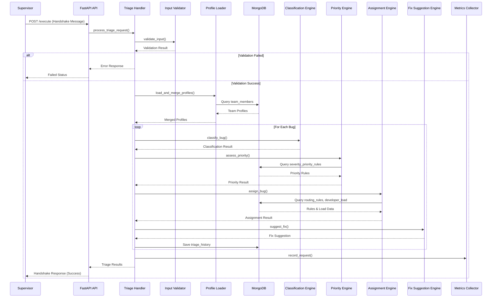
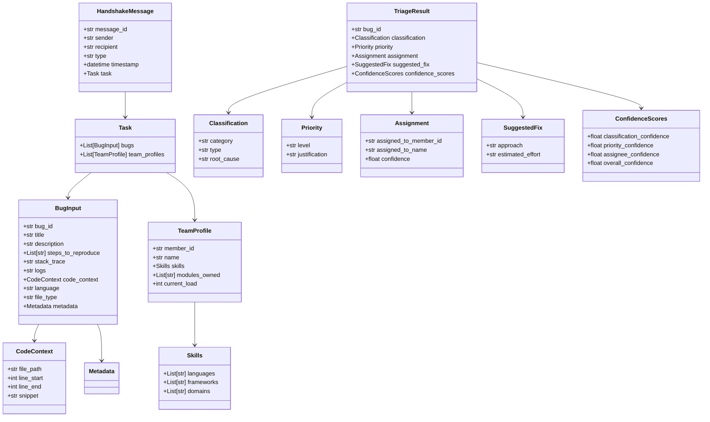

# Report Section 3: System Design & Architecture

## Purpose
This section provides a comprehensive overview of the Bug Triage AI Agent's system architecture, including component design, data flow, module/class structure, and agent communication model.

## Target Length
3-4 pages in the final PDF report (with diagrams)

## Content Structure

### 3.1 Architecture Overview

**High-Level Architecture:**

The Bug Triage AI Agent follows a layered architecture pattern with clear separation of concerns:

1. **API Layer** (FastAPI): Handles HTTP requests, routing, and response formatting
2. **Handler Layer**: Orchestrates request processing and coordinates engines
3. **Engine Layer**: Core business logic (classification, priority, assignment, fix suggestion)
4. **Data Layer**: MongoDB database for persistent storage
5. **Utility Layer**: Supporting functions (validation, language detection, metrics)

**Architecture Principles:**
- **Modularity:** Each component has a single responsibility
- **Separation of Concerns:** Clear boundaries between layers
- **Dependency Injection:** Components are loosely coupled
- **Graceful Degradation:** System continues functioning if database unavailable
- **Extensibility:** Easy to add new engines or features

### 3.2 System Architecture Diagram

**Mermaid.js Code for System Architecture:**

```mermaid
graph TB
    subgraph "External Systems"
        Supervisor[Supervisor Agent]
        MongoDB_Ext[(MongoDB Database)]
    end
    
    subgraph "Bug Triage AI Agent"
        subgraph "API Layer"
            FastAPI[FastAPI Application]
            Health[Health Check Endpoint]
            Execute[Execute Endpoint]
            Metrics[Metrics Endpoint]
        end
        
        subgraph "Handler Layer"
            TriageHandler[Triage Handler]
            RequestValidator[Request Validator]
            ProfileLoader[Team Profile Loader]
        end
        
        subgraph "Engine Layer"
            Classification[Classification Engine]
            Priority[Priority Engine]
            Assignment[Assignment Engine]
            FixSuggestion[Fix Suggestion Engine]
        end
        
        subgraph "Data Layer"
            DBConnection[Database Connection]
            TeamMembers[Team Members Collection]
            ModuleOwnership[Module Ownership Collection]
            HistoricalBugs[Historical Bugs Collection]
            SeverityRules[Severity Priority Rules]
            DeveloperLoad[Developer Load Collection]
            RoutingRules[Routing Rules Collection]
            TriageHistory[Triage History Collection]
        end
        
        subgraph "Utility Layer"
            LanguageDetector[Language Detector]
            CodeAnalyzer[Code Analyzer]
            MetricsCollector[Metrics Collector]
            Logger[Logging System]
        end
    end
    
    Supervisor -->|POST /execute| Execute
    Execute --> TriageHandler
    TriageHandler --> RequestValidator
    TriageHandler --> ProfileLoader
    TriageHandler --> Classification
    TriageHandler --> Priority
    TriageHandler --> Assignment
    TriageHandler --> FixSuggestion
    
    ProfileLoader --> DBConnection
    Priority --> DBConnection
    Assignment --> DBConnection
    TriageHandler --> DBConnection
    
    DBConnection --> TeamMembers
    DBConnection --> ModuleOwnership
    DBConnection --> HistoricalBugs
    DBConnection --> SeverityRules
    DBConnection --> DeveloperLoad
    DBConnection --> RoutingRules
    DBConnection --> TriageHistory
    
    TriageHandler --> LanguageDetector
    Classification --> CodeAnalyzer
    TriageHandler --> MetricsCollector
    TriageHandler --> Logger
    
    Execute -->|Response| Supervisor
    Health -->|Status| Supervisor
    Metrics -->|Metrics| Supervisor
    
    DBConnection -.->|Optional| MongoDB_Ext
    
    style FastAPI fill:#E1F5FF,stroke:#01579B,stroke-width:2px
    style TriageHandler fill:#FFF3E0,stroke:#E65100,stroke-width:2px
    style Classification fill:#F3E5F5,stroke:#4A148C,stroke-width:2px
    style Priority fill:#F3E5F5,stroke:#4A148C,stroke-width:2px
    style Assignment fill:#F3E5F5,stroke:#4A148C,stroke-width:2px
    style FixSuggestion fill:#F3E5F5,stroke:#4A148C,stroke-width:2px
    style DBConnection fill:#E8F5E9,stroke:#1B5E20,stroke-width:2px
    style Supervisor fill:#FFEBEE,stroke:#B71C1C,stroke-width:2px
```



**Steps to Generate Architecture Diagram:**
1. Use Mermaid Live Editor (https://mermaid.live/) or VS Code with Mermaid extension
2. Copy the Mermaid.js code above
3. Paste into the editor
4. The diagram will render automatically
5. Export as PNG or SVG for report inclusion
6. Adjust colors and styling as needed

**Diagram Description:**
- **External Systems (Top):** Supervisor Agent and MongoDB Database
- **API Layer (Blue):** FastAPI endpoints for communication
- **Handler Layer (Orange):** Request orchestration and coordination
- **Engine Layer (Purple):** Core business logic engines
- **Data Layer (Green):** Database connection and collections
- **Utility Layer (Not colored):** Supporting utilities

### 3.3 Data Flow Diagram

**Mermaid.js Code for Data Flow:**



**Steps to Generate Data Flow Diagram:**
1. Use Mermaid Live Editor or diagramming tool
2. Copy the sequence diagram code above
3. Render the diagram
4. Export as PNG/SVG
5. Include in report with explanation

**Data Flow Description:**
1. Supervisor sends handshake message to `/execute` endpoint
2. API routes to Triage Handler
3. Input validation occurs
4. Team profiles loaded (from input + database)
5. For each bug: classification → priority → assignment → fix suggestion
6. Results aggregated and returned to Supervisor
7. Metrics recorded throughout

### 3.4 Component Design

#### 3.4.1 API Layer Components

**FastAPI Application (`src/main/app.py`):**
- **Purpose:** HTTP server and request routing
- **Components:**
  - `app`: FastAPI application instance
  - `/health`: Health check endpoint
  - `/execute`: Main triage execution endpoint
  - `/metrics`: Runtime metrics endpoint
  - CORS middleware for cross-origin requests

**Key Features:**
- Async request handling
- Automatic API documentation (Swagger/OpenAPI)
- Error handling middleware
- Request/response logging

#### 3.4.2 Handler Layer Components

**Triage Handler (`src/handlers/triage_handler.py`):**
- **Purpose:** Orchestrates the entire triage workflow
- **Key Functions:**
  - `process_triage_request()`: Main orchestration function
  - `create_error_response()`: Error response generation
- **Responsibilities:**
  - Input validation
  - Team profile loading
  - Bug processing coordination
  - Response generation
  - Error handling
  - Metrics recording

#### 3.4.3 Engine Layer Components

**Classification Engine (`src/engines/classification.py`):**
- **Purpose:** Categorize bugs by type and identify root causes
- **Key Functions:**
  - `classify_bug()`: Main classification function
  - `classify_category()`: Determine bug category
  - `classify_type()`: Identify specific error type
  - `analyze_root_cause()`: Root cause analysis
  - `calculate_confidence()`: Classification confidence score
- **Categories Supported:**
  - Runtime Error
  - Security Vulnerability
  - Performance Issue
  - UX/UI Issue
  - Logic Error
  - Configuration Error

**Priority Engine (`src/engines/priority.py`):**
- **Purpose:** Assess bug priority based on multiple factors
- **Key Functions:**
  - `assess_priority()`: Main priority assessment
  - `check_severity_rules()`: Apply severity-based rules
  - `determine_default_priority()`: Default priority logic
  - `calculate_priority_confidence()`: Priority confidence score
- **Priority Levels:**
  - Critical
  - High
  - Medium
  - Low

**Assignment Engine (`src/engines/assignment.py`):**
- **Purpose:** Match bugs to appropriate team members
- **Key Functions:**
  - `assign_bug()`: Main assignment function
  - `check_routing_rules()`: Apply routing rules
  - `calculate_assignment_score()`: Score team members
  - `match_by_language()`: Language-based matching
  - `match_by_module_ownership()`: Module ownership matching
  - `match_by_skills()`: Skills-based matching
  - `consider_workload()`: Workload balancing
- **Matching Criteria:**
  - Programming language expertise
  - Framework knowledge
  - Domain expertise
  - Module ownership
  - Current workload
  - Historical performance

**Fix Suggestion Engine (`src/engines/fix_suggestion.py`):**
- **Purpose:** Generate fix recommendations and effort estimates
- **Key Functions:**
  - `suggest_fix()`: Generate fix approach
  - `estimate_effort()`: Estimate time required
- **Output:**
  - Actionable fix approach
  - Effort estimate (hours/days)

#### 3.4.4 Data Layer Components

**Database Connection (`src/database/connection.py`):**
- **Purpose:** MongoDB connection management
- **Key Functions:**
  - `get_database()`: Get database instance
  - Connection pooling
  - Error handling

**Database Collections:**
1. **team_members:** Developer profiles, skills, workload
2. **module_ownership:** Module-to-developer mappings
3. **historical_bugs:** Past bug triage decisions
4. **severity_priority_rules:** Priority rules based on severity
5. **developer_load:** Current workload tracking
6. **embeddings:** Vector embeddings for similarity matching (future)
7. **routing_rules:** Custom routing rules
8. **triage_history:** Audit trail of all triage decisions

**CRUD Operations:**
- Each collection has dedicated module with CRUD functions
- Located in `src/database/` directory
- Functions: create, read, update, query

#### 3.4.5 Utility Layer Components

**Language Detector (`src/utils/language_detector.py`):**
- **Purpose:** Auto-detect programming language and file type
- **Key Functions:**
  - `detect_language_from_path()`: Detect from file path
  - `detect_file_type_from_path()`: Detect file extension
  - `validate_language_file_type_consistency()`: Validate consistency

**Validators (`src/utils/validators.py`):**
- **Purpose:** Input/output validation
- **Key Functions:**
  - `validate_input()`: Validate request format
  - `validate_output()`: Validate response format
  - `validate_bug_object()`: Validate bug structure
  - `validate_team_profiles()`: Validate team profiles

**Metrics Collector (`src/utils/metrics.py`):**
- **Purpose:** Runtime metrics tracking
- **Key Functions:**
  - `record_request()`: Record request metrics
  - `record_health_check()`: Record health check
  - `snapshot()`: Get current metrics
  - `uptime_seconds()`: Calculate uptime

**Logging (`src/utils/logging_config.py`):**
- **Purpose:** Structured logging configuration
- **Features:**
  - JSON-formatted logs
  - Configurable log levels
  - File and console output

### 3.5 Module/Class Design

**Mermaid.js Code for Class Diagram:**



**Steps to Generate Class Diagram:**
1. Use Mermaid Live Editor or UML tool
2. Copy the class diagram code above
3. Render the diagram
4. Export as PNG/SVG
5. Include in report

**Class Relationships:**
- `HandshakeMessage` contains `Task`
- `Task` contains multiple `BugInput` and `TeamProfile` objects
- `BugInput` contains `CodeContext` and `Metadata`
- `TeamProfile` contains `Skills` object
- `TriageResult` aggregates all result components

### 3.6 Agent Communication Model

**Supervisor-Worker Architecture:**

```
┌─────────────────┐
│  Supervisor     │
│     Agent       │
└────────┬────────┘
         │
         │ Handshake Protocol
         │ (JSON Messages)
         │
         ▼
┌─────────────────┐
│  Bug Triage     │
│     Agent       │
└─────────────────┘
```

**Communication Protocol:**

1. **Request Flow:**
   - Supervisor formats handshake message
   - POSTs to `/execute` endpoint
   - Includes bug data and team profiles

2. **Processing:**
   - Agent validates input
   - Processes bugs through engines
   - Queries database if needed
   - Generates triage results

3. **Response Flow:**
   - Agent formats handshake response
   - Includes triage results
   - Returns to Supervisor
   - Supervisor processes results

**Handshake Format:**
- **Request:** `message_id`, `sender`, `recipient`, `type`, `timestamp`, `task`
- **Response:** `message_id`, `sender`, `recipient`, `type`, `related_message_id`, `status`, `timestamp`, `results`, `warnings`

**Error Handling:**
- Validation errors return `status: "failed"` with error message
- Processing errors return `status: "failed"` with details
- Warnings included in response for missing optional fields

### 3.7 Database Schema Design

**MongoDB Collections:**

1. **team_members**
   - Developer profiles
   - Skills (languages, frameworks, domains)
   - Workload information
   - Performance metrics

2. **module_ownership**
   - Module-to-developer mappings
   - Technology stack per module

3. **historical_bugs**
   - Past bug triage decisions
   - Outcomes and resolutions

4. **severity_priority_rules**
   - Rules mapping severity to priority
   - Environment-specific rules

5. **developer_load**
   - Current workload per developer
   - Availability scores

6. **routing_rules**
   - Custom routing logic
   - Language-specific rules

7. **triage_history**
   - Audit trail
   - Decision timestamps

8. **embeddings**
   - Vector embeddings (future use)
   - Similarity matching

**Reference:** See `docs/bug-triage-agent/database-schemas.md` for detailed schemas

### 3.8 Technology Stack

**Backend Framework:**
- **FastAPI:** Modern Python web framework
- **Uvicorn:** ASGI server
- **Pydantic:** Data validation and settings management

**Database:**
- **MongoDB:** NoSQL document database
- **pymongo:** Python MongoDB driver

**Testing:**
- **pytest:** Testing framework
- **pytest-asyncio:** Async test support
- **pytest-cov:** Coverage reporting

**Utilities:**
- **python-dotenv:** Environment variable management
- **python-json-logger:** Structured logging
- **httpx:** HTTP client for testing

**Deployment:**
- **Docker:** Containerization (recommended)
- **MongoDB Docker Image:** Database container

### 3.9 Design Patterns Used

1. **Layered Architecture:** Clear separation of concerns
2. **Dependency Injection:** Loose coupling between components
3. **Strategy Pattern:** Different engines for different tasks
4. **Repository Pattern:** Database abstraction
5. **Factory Pattern:** Object creation (models, responses)
6. **Observer Pattern:** Metrics collection
7. **Template Method:** Common processing flow

## Writing Guidelines for AI Generation

**Format:**
- Use clear section headings (3.1, 3.2, etc.)
- Include diagrams with captions
- Reference code locations
- Explain design decisions
- Use consistent terminology

**Key Points:**
- Emphasize modularity and separation of concerns
- Highlight graceful degradation (database optional)
- Explain supervisor integration clearly
- Show data flow from input to output
- Document all major components

**Diagrams:**
- System architecture diagram (component view)
- Data flow diagram (sequence view)
- Class diagram (structure view)
- Reference existing network diagram if needed

**References:**
- Integration Plan: `docs/bug-triage-agent/integration-plan.md`
- Database Schemas: `docs/bug-triage-agent/database-schemas.md`
- Agent Specification: `docs/bug-triage-agent/agent-specification.md`
- Code Repository: `bug-triage-agent/src/`


