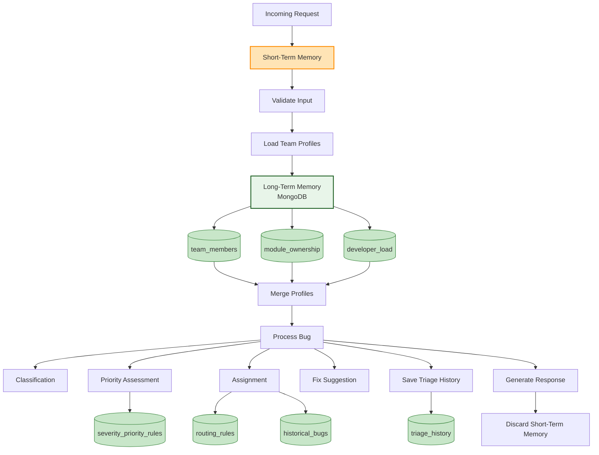

# Report Section 4: Memory Strategy

## Purpose
This section describes the short-term and long-term memory approach for the Bug Triage AI Agent, explaining how the agent stores, retrieves, and uses information to make intelligent triage decisions.

## Target Length
1-2 pages in the final PDF report

## Content Structure

### 4.1 Memory Strategy Overview

**Dual-Memory Architecture:**

The Bug Triage AI Agent employs a dual-memory strategy combining:
- **Short-Term Memory:** In-request context and immediate data
- **Long-Term Memory:** Persistent storage in MongoDB for historical learning

This approach enables the agent to:
- Make context-aware decisions using current request data
- Learn from historical patterns and outcomes
- Improve accuracy over time through accumulated knowledge
- Maintain team member profiles and workload information
- Track triage history for audit and analysis

### 4.2 Short-Term Memory

**Definition:**
Short-term memory refers to data that exists only during the processing of a single request. This data is transient and not persisted to the database.

**Components:**

#### 4.2.1 Request Context

**Data Stored:**
- **Bug Information:**
  - Bug ID, title, description
  - Steps to reproduce
  - Stack traces and logs
  - Code context (file path, snippet, line numbers)
  - Language and file type
  - Metadata (environment, tags, reporter)

- **Team Profiles (from input):**
  - Member IDs and names
  - Skills (languages, frameworks, domains)
  - Modules owned
  - Current workload

- **Processing State:**
  - Classification results
  - Priority assessment
  - Assignment calculations
  - Fix suggestions
  - Confidence scores

**Storage Location:**
- In-memory during request processing
- Passed between engine functions
- Not persisted unless explicitly saved

**Lifetime:**
- Created when request arrives
- Used during processing
- Discarded after response sent

**Use Cases:**
- Immediate bug analysis
- Real-time team profile matching
- Current workload consideration
- Temporary calculation storage

#### 4.2.2 Processing Cache

**Data Stored:**
- Validated input models
- Parsed code context
- Extracted patterns from stack traces
- Calculated scores and metrics

**Purpose:**
- Avoid redundant parsing
- Speed up processing
- Maintain consistency within request

**Implementation:**
- Python dictionaries and objects
- Function-level caching
- Request-scoped variables

### 4.3 Long-Term Memory

**Definition:**
Long-term memory refers to persistent data stored in MongoDB that persists across requests and enables learning from historical patterns.

**Storage:**
- **Database:** MongoDB
- **Collections:** 8 collections for different data types
- **Persistence:** Data survives agent restarts
- **Queryable:** Can be queried and updated

**Components:**

#### 4.3.1 Team Member Profiles (`team_members` collection)

**Data Stored:**
```json
{
  "member_id": "dev-01",
  "name": "John Doe",
  "email": "john@example.com",
  "skills": {
    "languages": ["python", "java"],
    "frameworks": ["django", "spring"],
    "domains": ["backend", "security"]
  },
  "modules_owned": ["auth", "session"],
  "primary_stack": "backend",
  "experience_years": 5,
  "past_bugs_fixed": 150,
  "workload": {
    "open_assigned_bugs": 3,
    "current_sprint_tasks": 5,
    "availability_score": 0.8
  },
  "performance_metrics": {
    "avg_fix_time_hours": 4.5,
    "reopen_rate": 0.05,
    "critical_issue_success_rate": 0.95
  },
  "preferences": {
    "prefers_security_tickets": true,
    "prefers_maintenance": false
  },
  "last_active": "2025-01-15T10:30:00Z",
  "created_at": "2024-01-01T00:00:00Z",
  "updated_at": "2025-01-15T10:30:00Z"
}
```

**Purpose:**
- Maintain up-to-date developer profiles
- Track skills and expertise
- Monitor workload and availability
- Store performance metrics
- Enable intelligent assignment

**Update Frequency:**
- Updated when workload changes
- Refreshed after bug assignments
- Performance metrics updated periodically

**Query Patterns:**
- Query by language expertise
- Query by module ownership
- Query by skills
- Query by availability

#### 4.3.2 Module Ownership (`module_ownership` collection)

**Data Stored:**
```json
{
  "module_name": "auth",
  "owners": ["dev-01", "dev-02"],
  "technology_stack": {
    "languages": ["python"],
    "frameworks": ["django"],
    "databases": ["postgresql"]
  },
  "description": "Authentication and authorization module"
}
```

**Purpose:**
- Map modules to owners
- Enable module-based assignment
- Track technology stack per module
- Support routing rules

**Use Cases:**
- Assign bugs to module owners
- Match bugs by technology stack
- Apply module-specific routing rules

#### 4.3.3 Historical Bugs (`historical_bugs` collection)

**Data Stored:**
```json
{
  "bug_id": "BUG-001",
  "classification": {
    "category": "Runtime Error",
    "type": "NullPointerException"
  },
  "priority": "high",
  "assigned_to": "dev-01",
  "resolution_time_hours": 6,
  "resolution_status": "fixed",
  "reopened": false,
  "triage_timestamp": "2025-01-10T14:30:00Z"
}
```

**Purpose:**
- Learn from past assignments
- Track resolution outcomes
- Identify patterns
- Improve future assignments

**Learning Applications:**
- Similar bug pattern matching
- Assignment success rate analysis
- Resolution time prediction
- Reopen rate tracking

#### 4.3.4 Severity Priority Rules (`severity_priority_rules` collection)

**Data Stored:**
```json
{
  "rule_id": "rule-001",
  "severity": "critical",
  "environment": "production",
  "priority": "critical",
  "conditions": {
    "affects_users": true,
    "data_loss_risk": true
  }
}
```

**Purpose:**
- Define priority mapping rules
- Environment-specific rules
- Customizable priority logic
- Consistent prioritization

**Update Frequency:**
- Updated by administrators
- Can be customized per organization
- Supports rule versioning

#### 4.3.5 Developer Load (`developer_load` collection)

**Data Stored:**
```json
{
  "member_id": "dev-01",
  "open_assigned_bugs": 3,
  "current_sprint_tasks": 5,
  "availability_score": 0.8,
  "last_updated": "2025-01-15T10:30:00Z"
}
```

**Purpose:**
- Track current workload
- Balance assignments
- Prevent overloading
- Calculate availability

**Update Frequency:**
- Updated after each assignment
- Refreshed periodically
- Real-time workload tracking

#### 4.3.6 Routing Rules (`routing_rules` collection)

**Data Stored:**
```json
{
  "rule_id": "route-001",
  "language": "python",
  "priority": "critical",
  "assigned_to": "dev-01",
  "conditions": {
    "module": "auth",
    "environment": "production"
  }
}
```

**Purpose:**
- Custom routing logic
- Override default assignment
- Language-specific rules
- Priority-based routing

**Use Cases:**
- Route critical Python bugs to senior developer
- Assign security bugs to security expert
- Override normal assignment logic

#### 4.3.7 Triage History (`triage_history` collection)

**Data Stored:**
```json
{
  "triage_id": "triage-001",
  "bug_id": "BUG-001",
  "timestamp": "2025-01-15T10:30:00Z",
  "classification": {...},
  "priority": {...},
  "assignment": {...},
  "suggested_fix": {...},
  "confidence_scores": {...},
  "raw_input": {...}
}
```

**Purpose:**
- Complete audit trail
- Decision tracking
- Performance analysis
- Debugging and troubleshooting

**Retention:**
- Stored for all triage decisions
- Can be queried for analysis
- Supports compliance and auditing

#### 4.3.8 Embeddings (`embeddings` collection) - Future Use

**Data Stored:**
```json
{
  "bug_id": "BUG-001",
  "embedding": [0.123, 0.456, ...],
  "text": "bug description and context",
  "created_at": "2025-01-15T10:30:00Z"
}
```

**Purpose:**
- Vector similarity matching
- Find similar historical bugs
- Improve classification accuracy
- Pattern recognition

**Status:**
- Schema defined
- Implementation planned for future
- Enables ML-based improvements

### 4.4 Memory Interaction Flow

**Mermaid.js Code for Memory Flow:**



**Steps to Generate Memory Flow Diagram:**
1. Use Mermaid Live Editor or diagramming tool
2. Copy the Mermaid.js code above
3. Render the diagram
4. Export as PNG/SVG
5. Include in report

**Flow Description:**
1. Request arrives → stored in short-term memory
2. Team profiles loaded from long-term memory (database)
3. Profiles merged (input + database)
4. Bug processed using both short-term and long-term data
5. Results generated
6. Triage history saved to long-term memory
7. Short-term memory discarded after response

### 4.5 Memory Update Strategies

#### 4.5.1 Real-Time Updates

**When Updated:**
- After bug assignment → update `developer_load`
- After triage decision → save to `triage_history`
- When workload changes → update `team_members.workload`

**Update Frequency:**
- Immediate (synchronous)
- Part of request processing
- Ensures data consistency

#### 4.5.2 Periodic Updates

**When Updated:**
- Performance metrics → updated daily/weekly
- Team member profiles → updated as needed
- Routing rules → updated by administrators

**Update Frequency:**
- Scheduled jobs (future)
- Manual updates
- Event-driven updates

#### 4.5.3 Learning Updates

**When Updated:**
- Historical bug patterns analyzed
- Assignment success rates calculated
- Performance metrics aggregated

**Update Frequency:**
- Batch processing (future)
- Periodic analysis
- Continuous improvement

### 4.6 Graceful Degradation

**Database Unavailability:**

The agent is designed to function even when MongoDB is unavailable:

1. **Short-Term Memory Only:**
   - Uses team profiles from request input
   - Processes bugs without database queries
   - Logs warnings about database unavailability

2. **Reduced Functionality:**
   - No historical bug matching
   - No routing rules application
   - No workload balancing from database
   - Basic assignment based on input profiles only

3. **Error Handling:**
   - Catches database connection errors
   - Logs warnings
   - Continues processing
   - Returns warnings in response

**Implementation:**
```python
try:
    team_profiles = load_and_merge_profiles(input_profiles, use_database=True)
except Exception as e:
    logger.warning(f"Database unavailable: {e}. Using input team profiles only.")
    team_profiles = load_and_merge_profiles(input_profiles, use_database=False)
```

### 4.7 Memory Performance Considerations

**Short-Term Memory:**
- **Size:** Minimal (request data only)
- **Access:** Fast (in-memory)
- **Cleanup:** Automatic (after request)

**Long-Term Memory:**
- **Size:** Grows over time (historical data)
- **Access:** Fast with indexes
- **Cleanup:** Optional (data retention policies)

**Optimization:**
- Database indexes on frequently queried fields
- Connection pooling for database access
- Caching of frequently accessed data (future)
- Batch operations for bulk updates

### 4.8 Future Memory Enhancements

**Planned Improvements:**
1. **Vector Embeddings:** Similarity matching for historical bugs
2. **Machine Learning:** Learn from past assignments
3. **Caching Layer:** Redis for frequently accessed data
4. **Analytics:** Advanced pattern recognition
5. **Predictive Models:** Predict resolution time, success rate

## Writing Guidelines for AI Generation

**Format:**
- Clear distinction between short-term and long-term memory
- Explain each collection's purpose
- Show memory interaction flow
- Describe graceful degradation
- Include future enhancements

**Key Points:**
- Emphasize dual-memory architecture
- Explain when each type of memory is used
- Show how memory enables learning
- Describe graceful degradation strategy
- Highlight performance considerations

**Diagrams:**
- Memory flow diagram (short-term ↔ long-term)
- Database schema overview
- Update strategies timeline

**References:**
- Database Schemas: `docs/bug-triage-agent/database-schemas.md`
- Implementation: `bug-triage-agent/src/database/`
- Team Profile Loader: `bug-triage-agent/src/utils/team_profile_loader.py`


